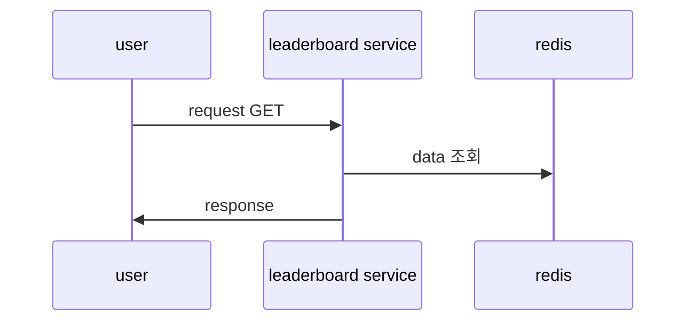

# First Come

## 목표 리스트

## 요약

- Fist Come 티켓팅 서비스를 개발합니다.

## 요구사항

- 1000개의 콘서트 티켓 좌석을 판매합니다.
  - vip석 100개, 일반석 900개
- 사용자는 단건만 구매가능 해야 합니다.

## 진행 과정
- 3개의 시나리오를 가지고 진행합니다.
- ONLY RDB 기능 구현
  - 가장 빠르게 구현합니다. 그리고 우리가 예상하는 이슈를 확인합니다.
  - k6로 application에 과부하를 주고 우리가 예상하는 이슈(한 번에 많은 read, write 요청, row lock)를 확인 합니다.
- REDIS, RDB 기능 구현
  - ONLY RDB로 예상한 이슈, 새로 발견한 이슈를 REDIS를 통해서 개선 합니다.
  - 예상한 이슈
    - 동시성은 redis counter로 확인 합니다.
    - 중복은 redis set을 통해 확인 합니다.
    - spark write는 redis에 중간 레이어를 주고 이를 batch로 rdb에 write 합니다. 

## 아키텍처

todo
[//]: # (![arch.png]&#40;arch.png&#41;)

## 설명


## 추가 고려사항


## 고려하지 않은 사항


## 시퀀스다이어그램

### sample 조회 flow



## 사용기술

- library : spring boot, java, jpa, jdbc, redis, kafka
- infra : mysql, redis, kafka

## Domain

## Sample

- sample
- index
    - sample

| field      | type   | pk  | Description  | 
|------------|--------|-----|--------------|
| id         | Long   | o   | id           |
| user_id    | String |     | 사용자 id       |
| matched_id | String |     | game 대전 id   |


## Main 로직 설명

### Sample

#### description

- todo

## Api

- [POST] Sample
- [GET] Sample

### [POST] Sample

#### description

- 

#### query

- none

#### request body

```json
{
  "sample": 4
}
```

### [GET] sample

#### description

- 

#### query

- 

#### request body

- none

#### response

```json
{
  "sample": "2025-03-22"
}
```
