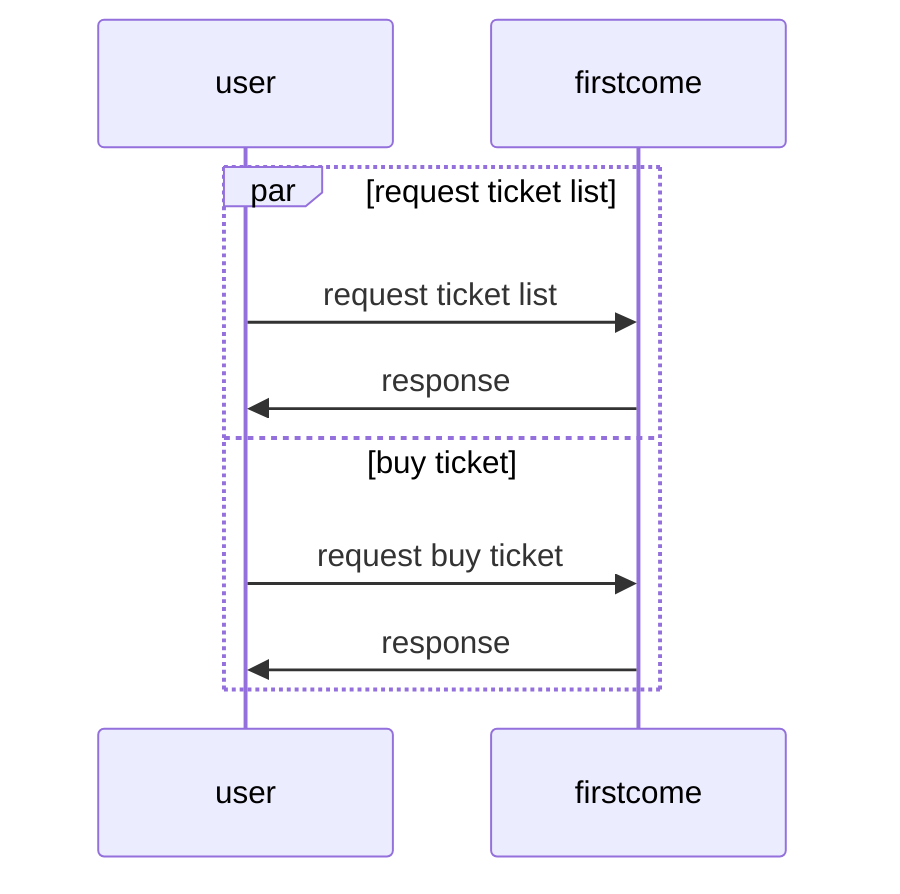

# First Come

## 목표 리스트

## 요약

- Fist Come 티켓팅 서비스를 개발합니다.

## 요구사항

- 1000개의 콘서트 티켓 좌석을 판매합니다.
    - vip석 100개, 일반석 900개
- 사용자는 잔여 좌석을 조회합니다.
- 사용자는 단건만 구매가능 해야 합니다.
- 콘서트 기간과 같은 구체적인 비지니스는 고려하지 않습니다.

## 진행 과정

- 몇가지 시나리오를 가지고 진행합니다.
- ONLY RDB 기능 구현
    - 가장 빠르게 구현합니다. 그리고 우리가 예상하는 이슈를 확인합니다.
    - k6로 application에 과부하를 주고 우리가 예상하는 이슈(한 번에 많은 read, write 요청, row lock)를 확인 합니다.
- REDIS, RDB 기능 구현
    - ONLY RDB로 예상한 이슈, 새로 발견한 이슈를 REDIS를 통해서 개선 합니다.
    - 예상한 이슈
        - 동시성은 redis counter로 확인 합니다.
        - 중복은 redis set을 통해 확인 합니다.
        - spark write는 redis에 중간 레이어를 주고 이를 batch로 rdb에 write 합니다.
    - 새로 발견한 이슈
        - k6 테스트 확인 후 작성

## 아키텍처

todo
[//]: # (![arch.png]&#40;arch.png&#41;)

## 설명

## 추가 고려사항

## 고려하지 않은 사항

## 시퀀스다이어그램

### ONLY RDB FLOW



## 사용기술

- library : spring boot, java, jpa, jdbc, redis
- infra : mysql, redis

## Domain

## events

- event 정보를 가지고 있습니다. title, vip, 일반석의 정보를 가지고 있습니다.
- index
    - none

| field         | type    | pk  | Description | 
|---------------|---------|-----|-------------|
| id            | Long    | o   | id          |
| title         | String  |     | event 제목    |
| vip_number    | Integer |     | vip 전체 좌석   |
| normal_number | Integer |     | 일반석 전체 좌석   |

## event_venue_association

- event와 venue의 연관관계를 가집니다. 이는 1:1로 구성됩니다.
- index
    - event_id

| field         | type    | pk  | Description    | 
|---------------|---------|-----|----------------|
| id            | Long    | o   | id             |
| event_id      | Long  |     | event table id |
| venue_id      | Long |     | venue 의 가상의 id |

## venue_seats

- vip 좌석번호, 일반석 좌석 번호를 가지고 있습니다.
- events table과 연관관계를 가지고 있습니다.
- index
    - event_id

| field    | type   | pk  | Description          | 
|----------|--------|-----|----------------------|
| id       | Long   | o   | id                   |
| venue_id | Long   |     | venue는 있다는 가정으로 합니다. |
| type     | String |     | 좌석 tier              |

## user_tickets

- 사용자가 구매한 티켓 정보를 가지고 있습니다.
- user_id와 event_id는 유니크합니다.
- index
    - unique (user_id, event_id)
    - unique (event_id, event_seat_id)

| field         | type   | pk  | Description     | 
|---------------|--------|-----|-----------------|
| id            | Long   | o   | id              |
| user_id       | String |     | user id         |
| event_id      | Long   |     | events table id |
| event_seat_id | Long   |     | event seat id   |

## Main 로직 설명

### Sample

#### description

## Api

- [POST] /v1/events/{eventId}/tickets
- [GET] /v1/events/{eventId}/seats

### [POST] /v1/events/{eventId}/tickets

#### description

- event를 티켓팅합니다. 특정 seat를 티켓팅 합니다.

#### query

- none

#### request body

```json
{
  "userId": "userId01",
  "eventSeatId": 1
}
```

#### response

- none

### [GET] /v1/events/{eventId}/seats

#### description

- 예약할 수 있는 좌석을 조횝합니다.

#### query

- none

#### request body

- none

#### response

```json
{
  "eventId": "eventId01",
  "seats": [
    {
      "eventSeatId": 1,
      "type": "VIP"
    },
    {
      "eventSeatId": 2,
      "type": "NORMAL"
    }
  ]
}
```
